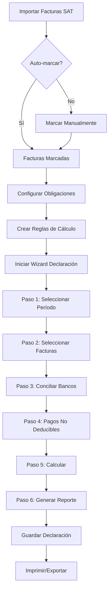

# Sistema de Declaraciones Fiscales SAT México
## Documentación Completa del Proyecto

---

## 📋 Índice

1. [Visión General](#visión-general)
2. [Arquitectura del Sistema](#arquitectura-del-sistema)
3. [Módulos Creados](#módulos-creados)
4. [Módulos por Crear](#módulos-por-crear)
5. [Instalación](#instalación)
6. [Configuración Inicial](#configuración-inicial)
7. [Flujo de Trabajo](#flujo-de-trabajo)
8. [Casos de Uso](#casos-de-uso)
9. [Próximos Pasos](#próximos-pasos)

---

## 🎯 Visión General

Sistema completo e integrado para gestionar declaraciones fiscales ante el SAT en México. El sistema permite:

- ✅ Configurar obligaciones fiscales por empresa
- ✅ Auto-marcar facturas para declaración
- ✅ Motor de cálculo dinámico con fórmulas programables
- ⏳ Proceso guiado paso a paso para crear declaraciones
- ⏳ Conciliación bancaria automática avanzada
- ⏳ Gestión de pagos no deducibles
- ⏳ Generación de reportes fiscales

**Leyenda:** ✅ = Completado | ⏳ = Pendiente

---

## 🏗️ Arquitectura del Sistema

```
┌─────────────────────────────────────────────────────────────────┐
│                    SISTEMA DE DECLARACIONES FISCALES            │
└─────────────────────────────────────────────────────────────────┘
                                 │
        ┌────────────────────────┼────────────────────────┐
        │                        │                        │
        ▼                        ▼                        ▼
┌───────────────┐      ┌──────────────────┐    ┌─────────────────┐
│   MÓDULO 1    │      │    MÓDULO 2      │    │   MÓDULO 3      │
│     BASE      │◄─────┤   SAT SYNC       │    │   WIZARD        │
│               │      │   INTEGRATION    │    │  DECLARACIONES  │
└───────┬───────┘      └──────────────────┘    └────────┬────────┘
        │                                                │
        │              ┌──────────────────┐             │
        └──────────────┤   MÓDULO 4       ├─────────────┘
                       │  CONCILIACIÓN    │
                       │    AVANZADA      │
                       └────────┬─────────┘
                                │
                       ┌────────▼─────────┐
                       │   MÓDULO 5       │
                       │    REPORTES      │
                       └──────────────────┘
```

---

## ✅ Módulos Creados

### 1. `l10n_mx_tax_declaration_base` (COMPLETADO)

**Propósito:** Módulo base con infraestructura para declaraciones fiscales

**Modelos Creados:**

```python
# Catálogos
- mx.tax.obligation.type    # Tipos de obligación (IVA, ISR, IEPS, etc.)
- mx.tax.periodicity         # Periodicidades (Mensual, Bimestral, etc.)

# Configuración
- mx.tax.obligation          # Obligaciones fiscales por empresa
- mx.tax.calculation.rule    # Reglas de cálculo dinámico

# Extensiones
- account.move (inherited)   # Campos de declaración fiscal
- res.company (inherited)    # Configuración de empresa
```

**Características:**

✅ **Catálogo completo de obligaciones fiscales del SAT:**
- IVA Mensual/Trimestral
- ISR Personas Morales/Físicas (Mensual/Anual)
- IEPS (Bebidas, Tabacos, Combustibles)
- ISAN, ISN, IDE
- RESICO (Mensual/Bimestral)
- Retenciones (ISR Salarios, Honorarios, Arrendamiento, IVA)
- Declaraciones Informativas (DIOT, DIPAS, Contabilidad Electrónica)
- Complementos (Recepción de Pagos, Nómina)

✅ **Motor de cálculo dinámico:**
- Suma simple
- Suma con filtros (dominio Odoo)
- Operaciones matemáticas (multiplicar, dividir, porcentaje)
- Fórmulas Python personalizadas (safe_eval)
- Sistema de variables y referencias entre cálculos

✅ **Auto-marcado de facturas:**
- Campo `include_in_tax_declaration` en facturas
- Estado de declaración (pending, included, excluded, declared)
- Período fiscal automático
- Filtros por tipo de factura

**Ubicación:** `/home/sergio/modulos_odoo18/l10n_mx_tax_declaration_base/`

**Archivos principales:**
```
l10n_mx_tax_declaration_base/
├── models/
│   ├── mx_tax_obligation_type.py       # Catálogo de tipos
│   ├── mx_tax_periodicity.py           # Catálogo de periodicidades
│   ├── mx_tax_obligation.py            # Obligaciones por empresa
│   ├── mx_tax_calculation_rule.py      # Motor de cálculo
│   ├── account_move.py                 # Extensión de facturas
│   └── res_company.py                  # Extensión de empresa
├── views/
│   ├── mx_tax_obligation_views.xml
│   ├── mx_tax_calculation_rule_views.xml
│   ├── account_move_views.xml
│   ├── res_company_views.xml
│   └── menu_views.xml
├── data/
│   ├── mx_tax_obligation_type_data.xml # 22+ tipos de obligaciones
│   └── mx_tax_periodicity_data.xml     # 10 periodicidades
├── security/
│   ├── security.xml
│   └── ir.model.access.csv
└── __manifest__.py
```

---

### 2. `l10n_mx_tax_declaration_sat_sync` (COMPLETADO)

**Propósito:** Integración con el módulo de importación de facturas del SAT

**Modelos Extendidos:**

```python
- cfdi.invoice.attachment (inherited)  # Wizard de importación
- ir.attachment (inherited)            # Attachments de XML
```

**Características:**

✅ **Extensión del wizard de importación:**
- Checkbox "Auto-marcar para Declaración"
- Campo "Período Fiscal por Defecto"
- Hook después de importar para marcar facturas

✅ **Acciones manuales:**
- Botón en attachments para marcar facturas relacionadas
- Notificaciones de éxito/error

**Ubicación:** `/home/sergio/modulos_odoo18/l10n_mx_tax_declaration_sat_sync/`

**Archivos principales:**
```
l10n_mx_tax_declaration_sat_sync/
├── models/
│   ├── cfdi_invoice_attachment.py     # Override del wizard
│   └── ir_attachment.py               # Extensión de attachments
├── views/
│   ├── cfdi_invoice_views.xml         # Campos en wizard
│   └── ir_attachment_views.xml        # Botón de marcado
└── __manifest__.py
```

**Dependencias:**
- `l10n_mx_tax_declaration_base`
- `l10n_mx_sat_sync_itadmin`

**Auto-instalación:** Sí (cuando ambos módulos padre están instalados)

---

## ⏳ Módulos por Crear

### 3. `l10n_mx_tax_declaration_wizard` (PENDIENTE)

**Propósito:** Wizard multi-paso para crear declaraciones fiscales

**Modelos a crear:**

```python
# Wizard principal
- mx.tax.declaration.wizard   # Wizard multi-paso
  Estados:
    - step1_config          # Configuración (período, obligaciones)
    - step2_invoices        # Selección de facturas
    - step3_reconcile       # Conciliación bancaria
    - step4_non_deductible  # Pagos no deducibles
    - step5_calculate       # Cálculos
    - step6_report          # Reporte final

# Declaración final
- mx.tax.declaration           # Cabecera de declaración
- mx.tax.declaration.line      # Líneas de facturas
- mx.tax.declaration.calculation  # Resultados de cálculos
```

**Flujo del wizard:**

```
PASO 1: Configuración
├─ Seleccionar período (inicio/fin)
├─ Seleccionar obligaciones fiscales
└─ Validar que existan facturas en el período

PASO 2: Selección de Facturas
├─ Lista de facturas marcadas para declaración
├─ Filtros por estado, tipo, monto
├─ Opción de agregar/quitar facturas manualmente
└─ Resumen de totales

PASO 3: Conciliación Bancaria
├─ Integración con account_reconcile_oca
├─ Aplicar reglas de conciliación automática
├─ Mostrar facturas conciliadas/no conciliadas
└─ Opción de conciliación manual

PASO 4: Pagos No Deducibles
├─ Lista de pagos sin factura
├─ Marcar como deducible/no deducible
├─ Justificación
└─ Resumen de montos

PASO 5: Cálculos
├─ Ejecutar reglas de cálculo configuradas
├─ Mostrar resultados por obligación
├─ Permitir ajustes manuales
└─ Validar consistencia

PASO 6: Reporte Final
├─ Vista previa del reporte
├─ Generar PDF
├─ Generar Excel
├─ Guardar declaración
└─ Opción de enviar por correo
```

---

### 4. `l10n_mx_auto_reconcile_enhanced` (PENDIENTE)

**Propósito:** Conciliación automática avanzada con reglas personalizables

**Modelos a crear:**

```python
# Reglas de conciliación directa
- mx.reconcile.rule
  Campos:
    - name: Nombre de la regla
    - sequence: Orden de ejecución
    - source_field: Campo en factura (ej: 'ref', 'folio_fiscal')
    - target_field: Campo en pago (ej: 'ref', 'communication')
    - match_type: equals | contains | like | in
    - case_sensitive: Boolean

# Reglas de conciliación por relación
- mx.reconcile.relation.rule
  Campos:
    - name: Nombre de la regla
    - payment_field: Campo en pago (ej: 'ref')
    - relation_model: Modelo intermedio (ej: 'sale.order')
    - relation_field: Campo en modelo intermedio (ej: 'client_order_ref')
    - invoice_relation_field: Relación a factura (ej: 'invoice_ids')

# Extensión de pagos
- account.payment (inherited)
  Nuevos campos:
    - is_deductible: Boolean
    - deductible_reason: Selection
    - reconcile_rule_id: Many2one a mx.reconcile.rule
```

**Ejemplo de reglas:**

```python
# Regla 1: Match directo por referencia
payment.ref == invoice.ref

# Regla 2: Match por UUID
payment.communication LIKE '%' + invoice.folio_fiscal + '%'

# Regla 3: Match por orden de venta
payment.ref IN [order.client_order_ref for order in invoice.invoice_line_ids.sale_line_ids.order_id]

# Regla 4: Match por monto y fecha
payment.amount == invoice.amount_total AND
payment.date dentro de 5 días de invoice.invoice_date
```

**Algoritmo de conciliación:**

```python
def auto_reconcile(invoices, payments):
    """
    1. Ordenar reglas por secuencia
    2. Para cada regla:
       a. Aplicar match según tipo
       b. Si hay match único: conciliar
       c. Si hay múltiples matches: marcar para revisión manual
       d. Si no hay match: continuar con siguiente regla
    3. Registrar regla utilizada en cada conciliación
    4. Generar reporte de conciliaciones
    """
```

---

### 5. `l10n_mx_tax_reports` (PENDIENTE)

**Propósito:** Generación de reportes fiscales imprimibles

**Reportes a crear:**

```python
# 1. Reporte de Declaración Completa
- Resumen ejecutivo
- Detalle por obligación fiscal
- Montos a pagar
- Fecha límite de pago

# 2. Reporte de Facturas Incluidas
- Lista de facturas por tipo
- Subtotales y totales
- Impuestos desglosados

# 3. Reporte de Conciliaciones
- Facturas conciliadas
- Reglas utilizadas
- Facturas pendientes de conciliar

# 4. Reporte de Pagos No Deducibles
- Lista de pagos sin factura
- Montos deducibles/no deducibles
- Justificaciones

# 5. Export para SAT
- Formato XML si aplica
- Archivos para upload
```

**Formatos de salida:**
- PDF (reportlab)
- Excel (xlsxwriter)
- XML (lxml)

---

## 📥 Instalación

### Requisitos

```bash
# Odoo 18
# Python 3.10+
# Dependencias Python (ya incluidas en Odoo):
- lxml
- reportlab
- xlsxwriter
```

### Pasos de instalación

```bash
# 1. Copiar módulos al directorio de addons
cd /home/sergio/modulos_odoo18/

# 2. Verificar que existan los módulos:
ls -la l10n_mx_tax_declaration_base/
ls -la l10n_mx_tax_declaration_sat_sync/

# 3. Reiniciar Odoo
sudo systemctl restart odoo18

# 4. Actualizar lista de aplicaciones en Odoo
# Apps > Actualizar lista de aplicaciones

# 5. Buscar e instalar "Declaraciones Fiscales SAT México"
# El módulo de integración se instalará automáticamente
```

---

## ⚙️ Configuración Inicial

### Paso 1: Configurar Obligaciones Fiscales

```
Menú: Declaraciones Fiscales > Obligaciones Fiscales > Crear
```

**Ejemplo: IVA Mensual**
```
Tipo de Obligación: IVA - Declaración Mensual
Periodicidad: Mensual
Día Límite de Pago: 17
Auto-incluir Facturas: ✓
Filtro de Tipo: Todas
```

### Paso 2: Crear Reglas de Cálculo

```
Menú: Declaraciones Fiscales > Reglas de Cálculo > Crear
```

**Ejemplo: IVA Causado**
```
Nombre: IVA Causado
Obligación: IVA - Declaración Mensual
Tipo de Cálculo: Suma con Filtros
Modelo Origen: Facturas
Campo a Sumar: Impuestos
Filtro (Dominio): [('move_type', '=', 'out_invoice'), ('state', '=', 'posted')]
Es Subtotal: ✓
Mostrar en Reporte: ✓
```

**Ejemplo: IVA Acreditable**
```
Nombre: IVA Acreditable
Obligación: IVA - Declaración Mensual
Tipo de Cálculo: Suma con Filtros
Campo a Sumar: Impuestos
Filtro: [('move_type', '=', 'in_invoice'), ('state', '=', 'posted')]
Es Subtotal: ✓
```

**Ejemplo: IVA a Pagar**
```
Nombre: IVA a Pagar
Obligación: IVA - Declaración Mensual
Tipo de Cálculo: Resta Simple
Operando 1: IVA Causado
Operando 2: IVA Acreditable
Es Monto Final: ✓
Mostrar en Reporte: ✓
```

### Paso 3: Configurar Auto-importación

```
Menú: Contabilidad > Configuración > Importar Facturas SAT

Al importar XML:
☑ Auto-marcar para Declaración
Período Fiscal: [dejar vacío para usar fecha de factura]
```

---

## 🔄 Flujo de Trabajo

### Flujo Completo de Declaración



### Ejemplo de Uso: Declaración IVA Mensual

```
1. PREPARACIÓN (Día 1-10 del mes)
   - Importar facturas del mes anterior del SAT
   - Verificar que estén marcadas para declaración
   - Revisar facturas en estado "Pendiente"

2. CONCILIACIÓN (Día 10-15)
   - Conciliar pagos con facturas
   - Marcar pagos sin factura como deducibles/no deducibles
   - Validar que todo esté conciliado

3. DECLARACIÓN (Día 15-17)
   - Iniciar wizard de declaración
   - Seleccionar período: 01/12/2024 - 31/12/2024
   - Seleccionar obligación: IVA Mensual
   - Revisar facturas incluidas
   - Ejecutar cálculos
   - Generar reporte

4. PRESENTACIÓN (Antes del día 17)
   - Imprimir reporte PDF
   - Exportar Excel
   - Presentar en portal SAT
   - Archivar declaración
```

---

## 💡 Casos de Uso

### Caso 1: Empresa con Régimen General

**Obligaciones:**
- IVA Mensual
- ISR Pagos Provisionales Mensuales (PM)
- ISR Declaración Anual (PM)
- Retención ISR Salarios
- DIOT

**Configuración:**
```python
# 5 obligaciones fiscales
# ~15 reglas de cálculo
# Auto-marcado para todas las facturas
```

### Caso 2: Persona Física con Actividad Empresarial

**Obligaciones:**
- IVA Mensual
- ISR Pagos Provisionales Mensuales (PF)
- ISR Declaración Anual (PF)

**Configuración:**
```python
# 3 obligaciones fiscales
# ~8 reglas de cálculo
# Auto-marcado solo para facturas de cliente
```

### Caso 3: RESICO

**Obligaciones:**
- IVA Trimestral
- RESICO Bimestral

**Configuración:**
```python
# 2 obligaciones fiscales
# ~6 reglas de cálculo
# Periodicidades diferentes
```

---

## 🚀 Próximos Pasos

### Fase 1: Completar Módulos Pendientes (Prioridad Alta)

1. **`l10n_mx_tax_declaration_wizard`**
   - [ ] Crear modelo wizard multi-paso
   - [ ] Implementar lógica de cada paso
   - [ ] Crear vistas del wizard
   - [ ] Integrar con módulos de conciliación

2. **`l10n_mx_auto_reconcile_enhanced`**
   - [ ] Crear modelos de reglas
   - [ ] Implementar algoritmo de conciliación
   - [ ] Crear vistas de configuración
   - [ ] Crear asistente de conciliación manual

3. **`l10n_mx_tax_reports`**
   - [ ] Diseñar plantillas de reportes
   - [ ] Implementar generación PDF
   - [ ] Implementar export Excel
   - [ ] Implementar export XML SAT

### Fase 2: Mejoras y Optimizaciones (Prioridad Media)

- [ ] Dashboard de declaraciones
- [ ] Calendario fiscal con fechas límite
- [ ] Alertas y notificaciones automáticas
- [ ] Integración con portal SAT (web scraping/API)
- [ ] Histórico de declaraciones
- [ ] Comparativas período vs período

### Fase 3: Funciones Avanzadas (Prioridad Baja)

- [ ] Machine learning para detección de anomalías
- [ ] Sugerencias automáticas de deducciones
- [ ] Integración con sistemas bancarios
- [ ] App móvil para aprobaciones
- [ ] Firma electrónica integrada

---

## 📊 Estimación de Tiempo

| Módulo | Complejidad | Tiempo Estimado |
|--------|-------------|-----------------|
| ✅ Módulo Base | Alta | ✓ Completado |
| ✅ SAT Sync Integration | Media | ✓ Completado |
| ⏳ Wizard Declaración | Alta | 2-3 días |
| ⏳ Conciliación Avanzada | Alta | 2-3 días |
| ⏳ Reportes | Media | 1-2 días |

**Total estimado:** 5-8 días de desarrollo

---

## 🔧 Tecnologías Utilizadas

- **Odoo 18** - Framework ERP
- **Python 3.10+** - Lenguaje de programación
- **PostgreSQL** - Base de datos
- **XML** - Vistas y datos
- **JavaScript (OWL)** - Frontend (para funciones avanzadas)
- **Reportlab** - Generación de PDFs
- **XlsxWriter** - Export a Excel

---

## 📞 Soporte

Para dudas o problemas con el sistema:

1. Revisar esta documentación
2. Revisar logs de Odoo: `/var/log/odoo/odoo.log`
3. Activar modo debug en Odoo
4. Contactar al desarrollador

---

## 📝 Notas Importantes

1. **Backup:** Siempre hacer backup antes de instalar módulos nuevos
2. **Testing:** Probar en ambiente de desarrollo antes de producción
3. **Actualizaciones:** Actualizar módulos después de cada cambio
4. **Permisos:** Configurar grupos de seguridad apropiados
5. **Multi-compañía:** El sistema soporta múltiples compañías

---

## ✅ Checklist de Implementación

```
Fase 1 - Módulos Base (COMPLETADO)
☑ Crear módulo l10n_mx_tax_declaration_base
☑ Crear catálogo de obligaciones fiscales
☑ Crear sistema de reglas de cálculo
☑ Extender model account.move
☑ Crear módulo de integración SAT Sync
☑ Implementar auto-marcado de facturas

Fase 2 - Wizard y Conciliación (PENDIENTE)
☐ Crear wizard multi-paso
☐ Implementar paso de selección de facturas
☐ Implementar paso de conciliación
☐ Implementar paso de pagos no deducibles
☐ Implementar paso de cálculos
☐ Crear módulo de conciliación avanzada
☐ Implementar reglas de match

Fase 3 - Reportes (PENDIENTE)
☐ Crear reportes PDF
☐ Crear exports Excel
☐ Crear exports XML SAT
☐ Implementar envío por correo

Fase 4 - Testing y Documentación (PENDIENTE)
☐ Testing de módulo base
☐ Testing de integración
☐ Testing de wizard completo
☐ Crear videos tutoriales
☐ Crear manual de usuario
```

---

**Última actualización:** 2025-12-01
**Versión:** 1.0.0
**Estado:** En desarrollo activo
